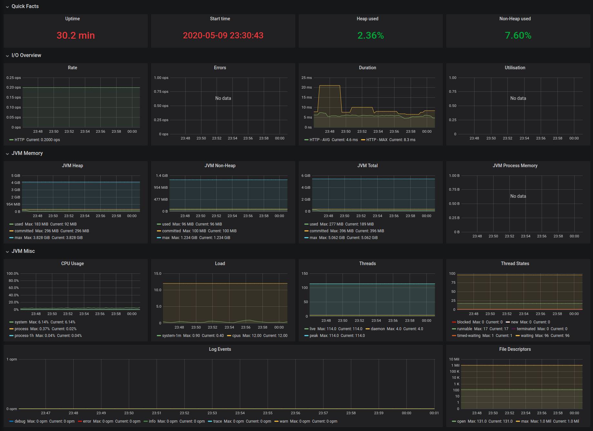

# Monitoring Micrometer

> Docker Compose help file to monitoring existent micrometer metrics in localhost

## Motivation
The goal of this project is to create an instance of [Prometheus](https://prometheus.io/) and one of [Grafana](https://grafana.com/) to monitor a [Spring Boot](https://spring.io/projects/spring-boot) application that exposes its metrics with [Micrometer](https://micrometer.io/).

The project was designed to monitoring the application locally during development. No type of configuration or optimization was done in this setup.

## Prerequisite
Run a Springboot application locally that exposes your metrics at http://localhost:8080/metrics or http://localhost:9090/metrics.

If your applications runs on another port you need to adjust this configuration in [this configuration file](prometheus/prometheus.yml).

## Running

```
git clone git@github.com:robsonbittencourt/monitoring-micrometer.git

cd monitoring-micrometer

docker-compose up -d
```

Go to http://localhost:3000 to access Grafana and click on the dashboard JVM Micrometer. The dashboard below will be displayed. Thanks to [Michael Weirauch](https://github.com/mweirauch) for the [Grafana dashboard](https://grafana.com/grafana/dashboards/4701)



## Micrometer Example

If you don't have an micrometer project but want test this you can use [this example project](https://github.com/robsonbittencourt/prometheus-micrometer-example).

```
docker run \
    -p 8080:8080 \
    -p 9090:9090 \
    --name prometheus-micrometer-example \
    robsonbittencourt/prometheus-micrometer-example
```    